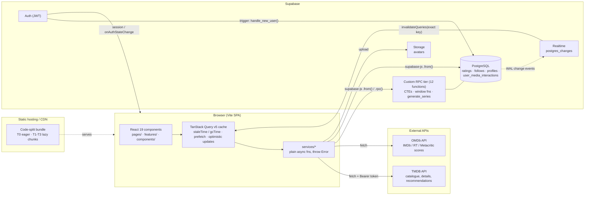

# usePopcorn

A movie and series discovery and social tracking platform. Users browse TMDB catalogues, rate titles, follow other users, and get analytics on their own viewing history. Analytics, aggregation and social-graph queries run inside PostgreSQL as 12 custom PL/pgSQL / SQL functions. The client receives pre-shaped `jsonb` or scalar results, not raw rows to reduce.

- **Client:** React 19, Vite, Tailwind CSS v4, TanStack Query v5, React Router v7 (data router)
- **Backend:** Supabase (Auth, PostgreSQL, Realtime, Storage). There is no application server. The browser talks to Supabase (PostgREST and RPC) and to TMDB / OMDb directly.
- **Language:** plain JavaScript / JSX, no TypeScript, no test suite. Lint: ESLint 10 flat config.

---

## 1. Architecture Overview



### Data flow

Data moves through three layers, and each layer has one job.

| Layer | Location | Responsibility |
|---|---|---|
| **Services** | `src/services/*` | Plain async functions with no React. `tmdb.js` / `omdb.js` wrap `fetch`. The rest (`ratings`, `follows`, `profiles`, `interactions`, `files`) call Supabase through one shared client (`src/lib/supabase.js`). Every function throws `Error` so React Query can surface it. |
| **Hooks** | `src/features/<feature>/hooks/*` | `useQuery` / `useInfiniteQuery` / `useMutation` wrappers. Third-party payloads (TMDB, OMDb) are normalised here, for example OMDb's `"N/A"` strings become `null` in a `select`. Mutations use optimistic updates: `onMutate` snapshot, `onError` rollback, `onSettled` invalidate. |
| **Components** | `src/features/<feature>/components`, `src/components/{ui,media}`, `src/pages/*` | Presentation. Shared primitives are `React.memo`-ed. |

### Auth gate and current user

`src/layout/AppLayout.jsx` guards every `/browse`, `/profile` and `/community` route. It resolves the Supabase session, redirects to `/login` when there is none, and **seeds the `['currentUser']` cache entry** from the session. `onAuthStateChange` keeps it in sync. `useCurrentUser()` reads that entry (`staleTime: Infinity`, `gcTime: Infinity`) and never fetches, so identity resolution costs zero extra round trips. Auth state is cached at boot and changes only through the auth listener.

---

## 2. Core Architectural Pillars

### 2.1 Offloading heavy computation to PostgreSQL RPCs

The profile analytics are set-based problems: gap detection over time series, per-type genre ranking after unnesting an array column, and calendar densification. PostgreSQL solves these in one pass over an index-scannable `ratings` slice. Doing them in the client would mean streaming every rating row for the user and reducing them in JavaScript.

| Concern | Where it runs | Effect |
|---|---|---|
| **Weekly streak, unbounded history** (`get_extended_streak`) | DB: gaps-and-islands variant. `generate_series` builds a dense week calendar, a `LEFT JOIN` marks activity, and `max(week_start) WHERE NOT had_activity` finds the most recent gap. | The client receives **one `integer`**. Without this it would receive one row per rating ever made. |
| **Annual activity heatmap** (`get_profile_heatmap`) | DB: `generate_series` over the week range, `LEFT JOIN`, `GROUP BY`, `jsonb_agg(... ORDER BY week_start)`. | The client receives at most 53 `{weekStart, count}` objects, including zero-weeks that a plain `GROUP BY` would drop. The grid renders without client-side date bucketing. |
| **Genre breakdown / totals** (`get_profile_stats`) | DB: `unnest(genre_ids)`, then `row_number() OVER (PARTITION BY type ORDER BY genre_count DESC)`, keeping ranks ≤ 3 per type. | The client gets one `jsonb` document with counts, average score, watch-hours and top-3 genres per media type. |

**Two-tier streak evaluation.** The streak card shows how the cheap and the expensive query are combined (`src/features/profile/hooks/useProfileStreak.js`):

1. `get_recent_weekly_activity` returns a fixed 12-week window. The client drops the in-progress week and counts back from the latest completed week.
2. Only if all 11 completed weeks in that window have activity (`isSaturated`) does the client enable the second query, `get_extended_streak`. The unbounded gap-detection query therefore runs only for users who could exceed the window.

Both queries use `staleTime: 15 min`.

**Payload shape:** RPCs that return `jsonb` return the exact shape the component consumes (`{ year, joinedAt, weeks: [...] }`, `{ totalRated, averageScore, topGenres: [...] }`). No client-side `reduce`, `groupBy` or date arithmetic sits between the response and the render.

### 2.2 Client cache strategy and speculative prefetching

Global defaults live in `src/main.jsx`:

```js
queries: { staleTime: 5 min, gcTime: 10 min, retry: 1, refetchOnWindowFocus: false }
```

Per-query overrides follow the volatility of the data. `staleTime` is always set explicitly:

| Data | `staleTime` | `gcTime` | Reasoning |
|---|---|---|---|
| Current user | `∞` | `∞` | Seeded from the session, changed only via the auth listener or `setQueryData`. |
| Browse rows / grid pages (TMDB) | 15 min | 15 min | `gcTime` equals `staleTime`. Data past `staleTime` refetches anyway, so holding it longer only keeps stale objects in memory. |
| Media details, recommendations, best-rated window, weekly streak | 15 min | default | Slow-moving. |
| OMDb external scores | 1 h | 1 h | Third-party scores change slowly, and the free OMDb tier is rate limited. |
| TV season details | `∞` | 1 h | Episode metadata is effectively immutable. |
| Heatmap (`profileActivity`), profile stats, suggested users | `∞` | default | Invalidated explicitly by mutations (for example `useUploadRating` invalidates `profileStats` and the current year's `profileActivity`). |
| Title search | 1 min | 5 min | `gcTime` stays above `staleTime` so cache entries never disappear while still fresh. |

**`keepPreviousData` and `isPlaceholderData` (paginated grid).** `useCategoryMediaGrid` keys each TMDB page as `[...base, 'grid', page]` and sets `placeholderData: keepPreviousData`. When the user pages forward, the previous page stays mounted while the next loads. The UI takes its "refreshing" state from `isPlaceholderData || isFetching` (`CategoryMediaRow.jsx`), which dims the old grid instead of unmounting it. Nothing suspends, so this avoids layout thrash and skeleton flashes. `useSearch` uses the same option so results persist while the debounced query changes.

**Zero-latency pagination via background prefetch.** Once page *N* lands, an effect calls `queryClient.prefetchQuery` for page *N+1* with the same `staleTime`. It no-ops if that page is already fresh or in flight, so it cannot duplicate requests. The prefetch stops at `min(total_pages, 500)`, because TMDB returns 400 past page 500 regardless of what `total_pages` says.

**Bounded infinite scroll.** Row mode uses `useInfiniteQuery` and caps accumulation at `MAX_ROW_PAGES = 5` (100 items), so a row cannot grow without limit in memory. Only one of the row and grid queries is `enabled` at a time, so expanding a row never causes two concurrent fetch pipelines.

**Realtime invalidation, not polling.** `useFeedRealtime` and `useAverageRatingRealtime` subscribe to Supabase `postgres_changes` on `ratings`, with server-side filters (`user_id=in.(…)` for followed users, `tmdb_id=eq.<id>`). Each event calls `invalidateQueries` with the exact key the reader uses (`['feed', userId]`, `['ratings','average', tmdbId]`). Channels are torn down on unmount, and the following-id list is sorted and joined into a stable string so the channel is not resubscribed on every render.

**Route-level speculative loading.** `src/App.jsx` splits routes into tiers, and `AppLayout` runs a prefetch cascade once per session:

| Tier | Chunks | Loaded |
|---|---|---|
| T0 (eager) | Landing, Login, Register, NotFound | First paint |
| T1 | `BrowsePage` | Prefetched as soon as the session resolves, during the auth spinner |
| T2 | `ProfilePage`, `DetailPage` (plus `ForgotPassword` / `ResetPassword` on demand) | `requestIdleCallback` slot |
| T3 | `CommunityPage`, `ProfileStatsPage` | Later `requestIdleCallback` slot |

`requestIdleCallback` has a `timeout: 3000` and a `setTimeout` fallback. Prefetch failures are swallowed, because `React.lazy` retries on navigation.

**Optimistic mutations.** Rating upsert follows `cancelQueries` → snapshot → `setQueryData` → rollback on error → invalidate on settle. Ratings, average rating, profile stats and the heatmap year all refresh from `onSettled`.

### 2.3 Relational integrity and boundary normalisation

- **One vocabulary across the boundary.** TMDB names the series media type `tv` (`/tv/{id}`, `/discover/tv`). The browse UI says "Series". Two mappings exist (`SECTION_TO_TYPE = { movies: 'movie', series: 'tv' }` and the FETCH_MAP section keys), and they are resolved once, at the routing boundary in `useCategoryMedia.js`. The `ratings.type` column stores TMDB's own values (`'movie'` | `'tv'`), and the RPCs filter on them directly (`count(*) filter (where type = 'tv')` in `get_profile_stats`). The value the client writes is the same value used in TMDB URLs and in SQL predicates, so there is no runtime translation step. The intent is for a `CHECK (type IN ('movie','tv'))` constraint to enforce this in the schema.
- **Idempotent writes via composite key.** Ratings are written with `upsert(..., { onConflict: 'user_id,tmdb_id' })`. This relies on a composite unique constraint on `(user_id, tmdb_id)`, which gives "one rating per user per title" without a read-before-write and makes a re-rate a single statement. The same constraint gives the index that serves the `WHERE user_id = … AND tmdb_id = …` lookups, so no separate duplicate index is needed on those columns.
- **Follows** are `(follower_id, following_id)` edges. Social RPCs join `ratings ⨝ follows ⨝ profiles` on those keys.
- **Profile lifecycle.** A `SECURITY DEFINER` trigger, `handle_new_user()`, creates the `profiles` row from `auth.users.raw_user_meta_data`, so signup is atomic and the client never writes a profile row itself. `delete_user()` deletes `auth.users` where `id = auth.uid()`, which comes from the verified JWT and cannot be spoofed by an argument. This removes the account, and cascades depend on the schema's foreign keys.
- **Data normalisation in hooks.** OMDb payloads are reduced to `{ imdb, metacritic, rottenTomatoes }` in a `select` (with `"N/A"` → `null`), so components never see the raw shape.

### 2.4 Component geometry and design system

- **Slot-based `FeatureCard`** (`src/components/ui/FeatureCard.jsx`). It exposes `heroBackground`, `heroContent`, `floatingIcon` and `children` slots and is wrapped in `React.memo`. The streak card and the home-page feature cards are compositions of this one primitive, and it ships a matching `FeatureCardSkeleton` with identical geometry, so loading and loaded states occupy the same box (no layout shift).
- **Concentric corner radii (`inner = outer − padding`).** The hero panel is nested in the card with padding `p-2` (0.5 rem). On `sm+` the outer radius is `rounded-4xl` (2 rem) and the inner is `rounded-3xl` (1.5 rem), which is exactly `2rem − 0.5rem`, so the inner curve is concentric with the outer one. Below `sm` the card uses `1.75rem` outer with `p-1.5` and a `1.25rem` inner radius.
- **Grid.** Cards use `aspect-2/3 h-full w-full`, so every card in a grid row matches the tallest sibling. The hero occupies a fixed 72% of the card height, and card grids reflow with responsive CSS Grid columns, not JS measurement.
- **Design tokens.** Colours and radii are defined once in `@theme` in `src/index.css` (`--color-primary`, `--color-surface-*`, `--radius-card`). Tailwind v4 generates utilities from these tokens.
- **Rendering discipline.** Presentational components are memoised, callbacks passed down use `useCallback`, and static arrays and objects are hoisted out of render bodies. Light tab panels toggle with `hidden`/`block` plus `role="tabpanel"` and `aria-hidden` and are not unmounted, so their DOM and query subscriptions persist across tab switches.

---

## 3. Deep Dive: Custom Database Engine

Eleven functions live in `public` (the trigger function also depends on the `auth` schema). The client reaches nine of them through `supabase.rpc(...)`. `handle_new_user` is invoked by the database on signup, and `delete_user` is invoked through `supabase.rpc('delete_user')`.

| # | Function & signature | Returns | Algorithmic strategy | Security posture |
|---|---|---|---|---|
| 1 | `handle_new_user()` | `trigger` | Trigger on `auth.users`. Inserts `(id, username, country)` into `public.profiles`, with `username` and `country` read from `raw_user_meta_data ->> …`. | `SECURITY DEFINER`. Runs as the function owner so it can write `profiles` during signup, before the user has a session. |
| 2 | `delete_user()` | `void` | Single `DELETE FROM auth.users WHERE id = auth.uid()`. `auth.uid()` reads the caller's verified JWT, so there is no user-supplied identifier to spoof. | `SECURITY DEFINER`, `search_path = 'public', 'auth'` |
| 3 | `get_extended_streak(p_user_id uuid)` | `integer` | CTE chain: `my_ratings` (distinct `date_trunc('week', created_at)`) → `week_range` (`generate_series` from first active week to last completed week) → `weekly_activity` (`LEFT JOIN`, `had_activity` flag) → `most_recent_gap` (`max(week_start) WHERE NOT had_activity`). Result is `count(*)` of weeks after the latest gap (or from the first week if there is none). Current, incomplete week excluded. | `SECURITY DEFINER`, `search_path = public` |
| 4 | `get_profile_stats(p_user_id uuid)` | `jsonb` | `unnest(genre_ids)` per type → `GROUP BY type, genre_id` → `row_number() OVER (PARTITION BY type ORDER BY genre_count DESC)`; keeps `rank <= 3`. Scalars via `count(*) FILTER (WHERE type = …)`, `round(avg(score), 1)` and `sum(runtime) FILTER (WHERE type = 'movie') / 60.0` for watch-hours. Assembled with `jsonb_build_object` / `jsonb_agg`. | `SECURITY DEFINER`, `search_path = public` |
| 5 | `get_profile_heatmap(p_user_id uuid, p_year integer)` | `jsonb` | `generate_series` of weeks from `max(joined_at, Jan 1)` to `min(Dec 31, today)`, `LEFT JOIN` to ratings on `date_trunc('week', created_at)`, `GROUP BY week`, `jsonb_agg(... ORDER BY week_start)`. Zero-activity weeks are preserved. Also returns `joinedAt`. | `SECURITY DEFINER`, `search_path = public` |
| 6 | `get_recent_weekly_activity(p_user_id uuid, p_weeks integer DEFAULT 12)` | `jsonb` | Same dense-calendar pattern over a rolling window of `p_weeks` weeks ending at the current week. Fixed-size output (12 by default). | `SECURITY DEFINER`, `search_path = public` |
| 7 | `get_best_rated_since(p_user_id uuid, p_since timestamptz)` | `jsonb` | `DISTINCT ON (type)` over the user's `movie` / `tv` ratings with `updated_at >= p_since`, `ORDER BY type, score DESC, updated_at DESC`, so each type keeps its best-scored rating (ties go to the most recently updated). `jsonb_object_agg(type, to_jsonb(t))` folds the two rows into one `{ movie, tv }` object (`{}` when the window is empty), each pick carrying `type`, `tmdb_id`, `title`, `poster_path`, `rating`. The client passes calendar-snapped windows from `src/utils/periods.js`: the month for the "of the Month" cards, then 3, 6 and 12 months as fallbacks that seed the recommendation rows, which then call TMDB `/recommendations`. | `SECURITY INVOKER` (default), marked `STABLE`, so RLS applies |
| 8 | `get_average_rating(p_tmdb_id integer)` | `numeric` | `ROUND(AVG(score)::numeric, 1)` over all ratings for a title. | `SECURITY INVOKER` (default), marked `STABLE` |
| 9 | `get_user_feed(current_user_id uuid)` | `TABLE(id, tmdb_id, title, poster_path, type, score, created_at, user_id, username, avatar_url)` | `ratings ⨝ follows ON r.user_id = f.following_id ⨝ profiles`, filtered by `f.follower_id = current_user_id`, `ORDER BY created_at DESC LIMIT 50`. The join and row cap are server-side, so the client receives at most 50 fully-hydrated rows. | `SECURITY INVOKER` (plpgsql default), so RLS applies |
| 10 | `get_friends_ratings(current_user_id uuid, p_tmdb_id integer)` | `TABLE(rating_id, score, created_at, user_id, username, avatar_url)` | Same three-way join, restricted to a single `tmdb_id`. Drives the friend activity tab on a title's page. | `SECURITY INVOKER`, so RLS applies |
| 11 | `get_suggested_users(current_user_id uuid)` | `TABLE(id, username, avatar_url, recent_activity_count, mutual_friend_count, suggestion_score)` | Three CTEs: `my_follows`, `user_activity` (ratings in the last 14 days, `GROUP BY user_id`) and `mutual_connections` (for users followed by people I follow, `count(follower_id)`). Score = `mutual × 10 + activity`. Excludes self and already-followed users via `NOT EXISTS`, requires `score > 0`, `ORDER BY suggestion_score DESC LIMIT 4`. | `SECURITY INVOKER`, so RLS applies |

### Selected implementations

**Weekly streak via gap detection** (`get_extended_streak`). It is a dense-calendar variant of gaps-and-islands. Only the most recent island matters, so it needs no `row_number()` difference trick: it finds the last inactive week and counts the weeks after it.

```sql
with my_ratings as (
  select distinct date_trunc('week', created_at)::date as week_start
  from ratings where user_id = p_user_id
),
week_range as (
  select generate_series(
    (select min(week_start) from my_ratings),
    date_trunc('week', current_date - interval '1 week')::date,
    interval '1 week')::date as week_start
),
weekly_activity as (
  select w.week_start, (r.week_start is not null) as had_activity
  from week_range w left join my_ratings r on r.week_start = w.week_start
),
most_recent_gap as (
  select max(week_start) as gap_week from weekly_activity where not had_activity
)
select count(*)::int
from weekly_activity, most_recent_gap
where week_start > coalesce(most_recent_gap.gap_week,
                            (select min(week_start) from weekly_activity) - interval '1 week');
```

**Top genres per media type** (`get_profile_stats`):

```sql
genre_counts as (
  select type, unnest(genre_ids) as genre_id, count(*) as genre_count
  from my_ratings group by type, genre_id
),
ranked_genres as (
  select type, genre_id, genre_count,
         row_number() over (partition by type order by genre_count desc) as rank
  from genre_counts
)
-- …jsonb_agg(...) where rank <= 3
```

**Suggestion scoring** (`get_suggested_users`), a weighted mutual-graph plus recency score:

```sql
(COALESCE(mc.mutual_count, 0) * 10 + COALESCE(ua.activity_count, 0)) AS suggestion_score
```

### Security notes

- The four analytics functions are `SECURITY DEFINER`. They take a `p_user_id` parameter because the app renders other users' public profiles (`/profile/:userId`), so the caller is not always the subject. Definer rights bypass row-level policies, so the functions only expose aggregates of the target user's ratings and never expose other tables. `search_path` is pinned to `public` on each, which prevents search-path hijacking of a definer function.
- The social functions (`get_user_feed`, `get_friends_ratings`, `get_suggested_users`) and `get_average_rating` run as `SECURITY INVOKER`, so RLS policies on `ratings`, `follows` and `profiles` stay in force for them.
- `delete_user()` accepts no arguments, and the target is derived from the JWT.
- The Supabase **anon key** and the TMDB / OMDb keys are `VITE_`-prefixed and are therefore embedded in the client bundle. Authorization has to come from RLS and the RPC design above. The TMDB and OMDb keys should be treated as public, low-privilege, rate-limited credentials.

> The SQL definitions, constraints and indexes described here are maintained in the Supabase project. The repository contains the client only (there is no `supabase/migrations` directory yet).

---

## 4. Key Features

**Discovery**
- Category rails for movies and series (trending, popular, top rated, now playing / on the air, two rolling *upcoming* windows) and per-genre `/discover` rows.
- Each row is an infinite-scrolling horizontal strip that expands into a paginated grid, with `keepPreviousData` transitions and next-page prefetch (see 2.2).
- Debounced title search, overlay results, and user search.
- Title pages with tabbed Overview / Scores / Seasons / Friend Activity panels. TMDB details are fetched with `append_to_response` (credits, providers, release dates or content ratings, external IDs) to keep it to one request. IMDb, Rotten Tomatoes and Metacritic scores are fetched separately through OMDb once an IMDb id is known. Season details load lazily, only after the Seasons tab is visited.
- Favourites and watchlist toggles (optimistic).
- Movie and series recommendation rows seeded from the user's movie and series of the month (`get_best_rated_since`, then TMDB `/recommendations`), widening to the last 3, 6 or 12 months when a type has no pick and labelling the window used.

**Social**
- Feed of followed users' ratings (`get_user_feed`), live-updated over Realtime.
- Mutual-friend suggestions (`get_suggested_users`, `mutual × 10 + 14-day activity`).
- Inline friend ratings on each title (`get_friends_ratings`).
- Follow / unfollow with follower and following counts, public profile pages.
- Live community average rating on each title (`get_average_rating` plus a Realtime subscription filtered by `tmdb_id`).

**Analytics**
- Annual activity heatmap (`get_profile_heatmap`, per year).
- Running weekly streak (two-tier, described in 2.1).
- Movie and series "of the Month" highlight cards (`get_best_rated_since`).
- Totals, average score, watch-hours and top-3 genres per media type (`get_profile_stats`).

**Account**
- Email/password auth with password recovery, profile editing (username, country, email, password), avatar upload and removal via Supabase Storage, and self-service account deletion through `delete_user()`.

---

## 5. Tech Stack

| Layer | Technology | Strategic tradeoff |
|---|---|---|
| Frontend | **React 19** | Concurrent renderer and `React.memo` / `lazy` / `Suspense` primitives cover the rendering and splitting needs. No framework runtime (Next.js / Remix) is needed for a client-rendered app behind an auth gate, so there is no SSR complexity and static hosting is enough. |
| Frontend | **Vite 8** | Native-ESM dev server and Rollup production build with automatic per-route chunking for `React.lazy`. |
| Frontend | **React Router v7** (`createBrowserRouter`) | Data-router API with nested layouts (`PublicLayout` / `AppLayout`), and the auth gate lives in a layout route rather than being repeated per page. |
| Frontend | **Tailwind CSS v4** (`@tailwindcss/vite`) | Zero-runtime styling with tokens declared in `@theme`. Removes CSS-in-JS runtime cost and keeps geometry (radii, aspect ratios) declarative. |
| Frontend | react-hook-form, react-hot-toast, date-fns, react-icons | Uncontrolled form inputs (fewer re-renders than controlled forms), small toast surface, and tree-shakeable date and icon imports. |
| State / cache | **TanStack Query v5** | Handles server state, request deduplication, `staleTime` / `gcTime` control, `keepPreviousData`, `prefetchQuery` and optimistic mutations. A global store (Redux/Zustand) would mean reimplementing cache invalidation by hand. There is no client-side state library beyond it and local `useState`. |
| Backend / DB | **Supabase / PostgreSQL** | Relational data (ratings ⨝ follows ⨝ profiles) with real SQL: CTEs, window functions and `generate_series` power the analytics. A document store would push joins and aggregates into the client. Supabase also provides Auth, Realtime and Storage without a custom server. |
| Backend / DB | **PL/pgSQL / SQL RPCs** | Aggregation runs next to the data, and the wire carries small pre-shaped results. The tradeoff is that logic lives in the database and needs migration discipline, and the DB CPU is shared across users. |
| Backend / DB | **Supabase Realtime** (`postgres_changes`) | Push-based invalidation for feed and average ratings, with server-side row filters, instead of polling. |
| External | **TMDB API** (v4 bearer token) | Primary catalogue: trending, discover, details, recommendations, images. |
| External | **OMDb API** | Supplies IMDb / Rotten Tomatoes / Metacritic scores that TMDB does not expose. Isolated behind its own hook with a 1-hour cache because it is the most rate-limited dependency. |

---

## 6. Local Setup

### Prerequisites

- A current Node.js LTS (Vite 8 requires a recent Node) and **pnpm**
- A Supabase project with the schema and RPC functions from section 3
- A TMDB account (v4 read-access token) and an OMDb API key

### Environment contract

Copy `.env.example` to `.env`. All variables are read through `import.meta.env` and are **required**:

```dotenv
# Supabase project (Settings → API)
VITE_SUPABASE_URL=https://<project-ref>.supabase.co
VITE_SUPABASE_ANON_KEY=<supabase-anon-public-key>

# TMDB (v3 base URL, v4 read-access bearer token)
VITE_TMDB_BASE_URL=https://api.themoviedb.org/3
VITE_TMDB_API_KEY=<tmdb-v4-read-access-token>

# OMDb
VITE_OMDB_API_KEY=<omdb-api-key>
```

`.env` is git-ignored. `.env.example` is tracked.

### Commands

```bash
pnpm install     # install dependencies
pnpm dev         # Vite dev server
pnpm build       # production build → dist/
pnpm preview     # serve the built bundle locally
pnpm lint        # ESLint (@eslint/js recommended + react-hooks + react-refresh)
```

The `@/` import alias maps to `src/` (`vite.config.js`, `jsconfig.json`).

---

## 7. Repository Layout

```text
src/
├── App.jsx                # Route table, tiered lazy loading
├── main.jsx               # QueryClient defaults
├── layout/                # AppLayout (auth gate + prefetch cascade), PublicLayout, Navbar
├── pages/{public,auth,app}
├── features/
│   ├── auth/              # session, current user, password recovery
│   ├── browse/            # category rail, rows, useCategoryMedia (row + grid hooks)
│   ├── media_details/     # detail tabs, TMDB/OMDb hooks, season loading
│   ├── ratings/           # rating UI, optimistic mutations, realtime average
│   ├── interactions/      # favourites / watchlist
│   ├── search/            # title and user search
│   ├── social/            # feed, follows, suggestions, realtime feed
│   └── profile/           # heatmap, streak, stats, avatar, account deletion
├── components/{ui,media}  # shared primitives (FeatureCard, Chip, Modal, MediaRow, …)
├── services/              # tmdb, omdb, ratings, follows, profiles, interactions, files
├── hooks/                 # generic hooks (debounce, intersection observer, focus trap, …)
├── utils/                 # pure helpers
└── lib/supabase.js        # shared Supabase client
```

`optimization.json` is the performance and bug audit log for the project (findings with `done` / `pending` status). An open item is list virtualisation for infinite rows. Route-level code splitting is implemented in `App.jsx`, although its audit entry (OPT-009) is still marked `pending`.
